# Rickedex (Rick and Morty Pokédex)

Um app Flutter que funciona como uma Pokédex do universo de Rick and Morty: é possível pesquisar, filtrar e descobrir personagens, episódios e localidades consumindo a The Rick and Morty API.

> **Stack**: Flutter + Dart + Firebase


---

## Índice
- [Funcionalidades Principais](#funcionalidades-principais)
  - [Dashboard & Navegação](#dashboard--navegação)
  - [Gamificação (Quiz & Ranking)](#gamificação-quiz--ranking)
  - [Autenticação & Perfil](#autenticação--perfil)
  - [Wiki (Personagens, Locais, Episódios)](#wiki-personagens-locais-episódios)
- [Utilidades](#utilidades)
  - [Favoritos](#favoritos)
  - [Random](#random)
- [APK](#apk)
- [Navegação Geral](#navegação-geral)
- [Componentes & Arquitetura](#componentes--arquitetura)
  - [Estrutura do Projeto](#estrutura-do-projeto)
  - [Padrões adotados](#padrões-adotados)
- [Busca & Filtros](#busca--filtros)
- [Compatibilidade](#compatibilidade)
- [Como rodar](#como-rodar)
- [Build de APK (Android)](#build-de-apk-android)
- [API](#api)

---

## Funcionalidades Principais 

### Dashboard & Navegação

A tela inicial (Feed) é como um hub central para o aplicativo.

- Visualização em Stacks: Pré-visualização de personagens, localidades, episódios e mídias em formato de pilhas.

- Skeleton Loading: Carregamento para melhor experiência do usuário.

- Pull-to-Refresh: Atualização de dados e cache.

- Menu Lateral (Drawer): Navegação entre os módulos do app.

<p>
  <a href="docs/screens/feed_page.png">
    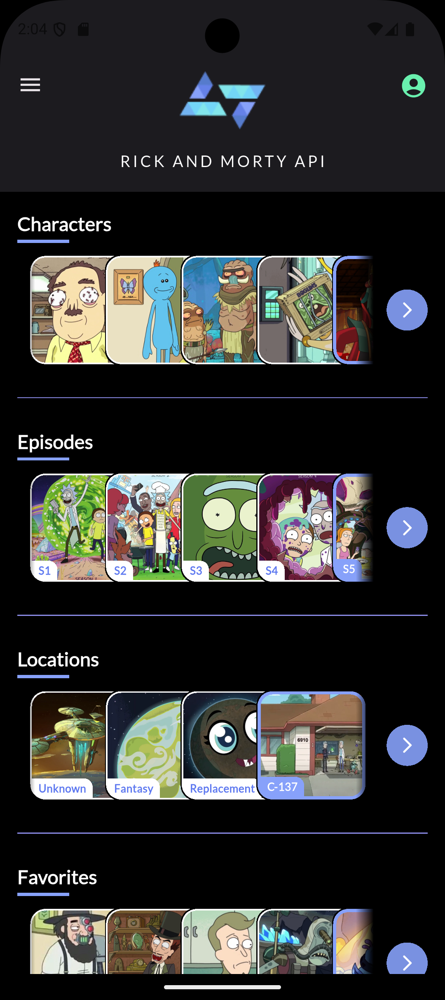
  </a>
  <a href="docs/screens/feed_loading.png">
    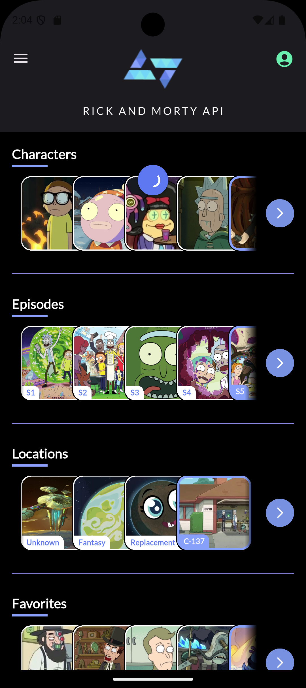
  </a>
  <a href="docs/screens/leaderboard_page.png">
    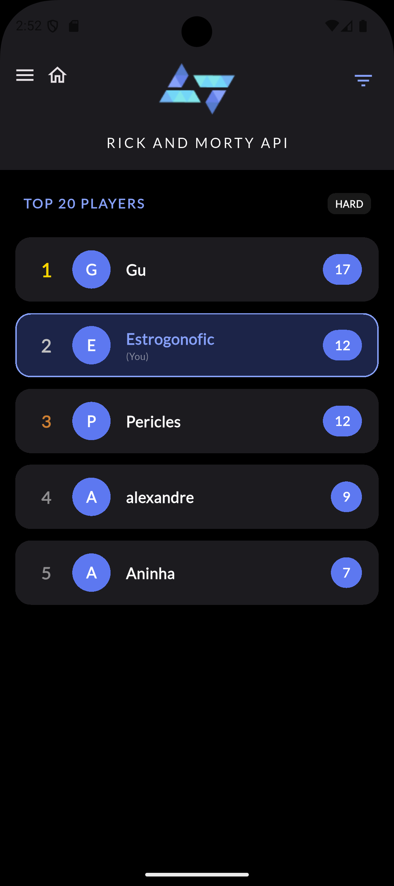
  </a>
</p>

### Gamificação (Quiz & Ranking)

Teste seu conhecimento sobre a série e compita com outros usuários.

- **Quiz Interdimensional**: Jogo de perguntas e respostas com 3 níveis de dificuldade:

  - *Fácil*: Apenas nomes e espécie.

  - *Médio*: Aumenta opções das perguntas de nome e espécie, e adiciona questões sobre status de vida e origem.

  - *Difícil*: Máximo de opções para nome e espécie, perguntas sobre status de vida, origem, primeiro episódio a aparecer e em quantos episódios participou.

- **Leaderboard Global**: Ranking sincronizado com Firestore.

  - Filtro por dificuldade (Easy, Medium, Hard).

  - Destaque para o Top 3 (ouro, prata, bronze).

  - *Regra de Negócio*: Apenas usuários com e-mail verificado aparecem no ranking.

<p>
  <a href="docs/screens/quiz_page.png">
    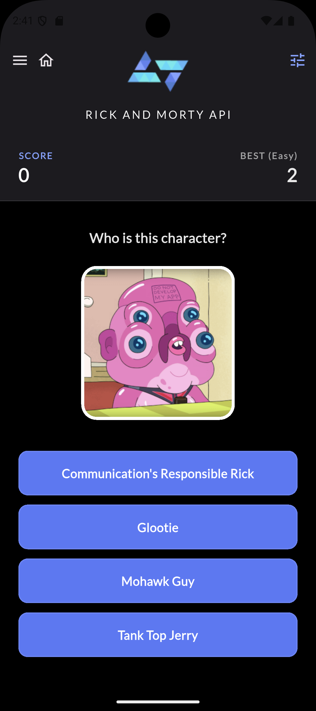
  </a>
  <a href="docs/screens/quiz_difficulties.png">
    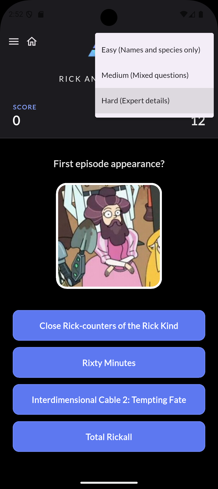
  </a>
  <a href="docs/screens/leaderboard_page.png">
    
  </a>
</p>

### Autenticação & Perfil

Sistema de gestão de usuários integrado ao Firebase.

- Login e Cadastro: Criação de conta com e-mail/senha e nickname único.

- Segurança: Verificação de e-mail e recuperação de senha.

- Cloud Sync: Sincronização automática de recordes (High Scores) entre dispositivos. Os pontos locais são migrados para a nuvem ao criar a conta.

- Perfil: Gestão de conta, visualização de status e logout seguro.

<p>
  <a href="docs/screens/login_page.png">
    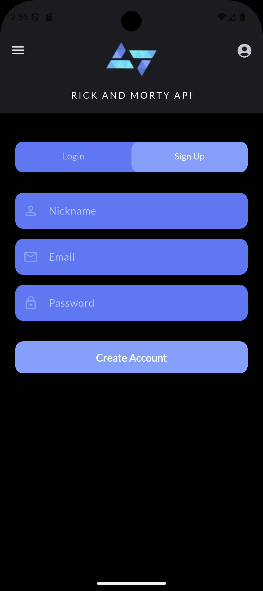
  </a>
  <a href="docs/screens/register_page.png">
    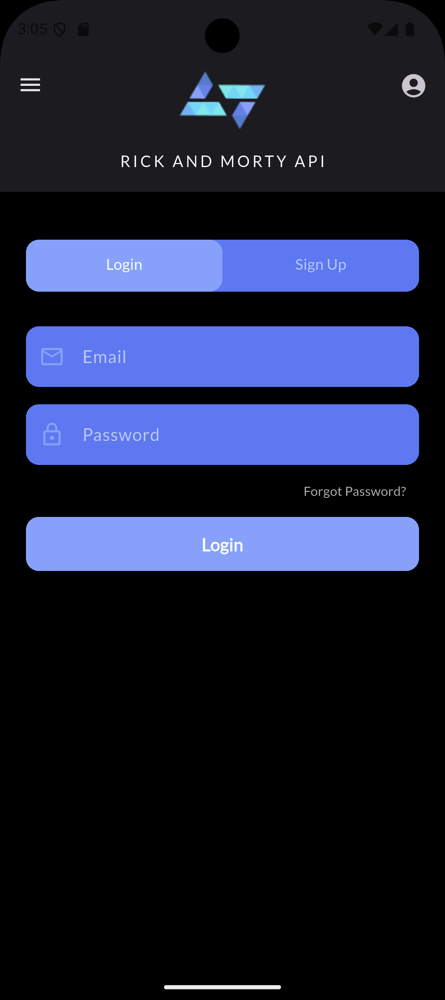
  </a>
  <a href="docs/screens/new_account.png">
    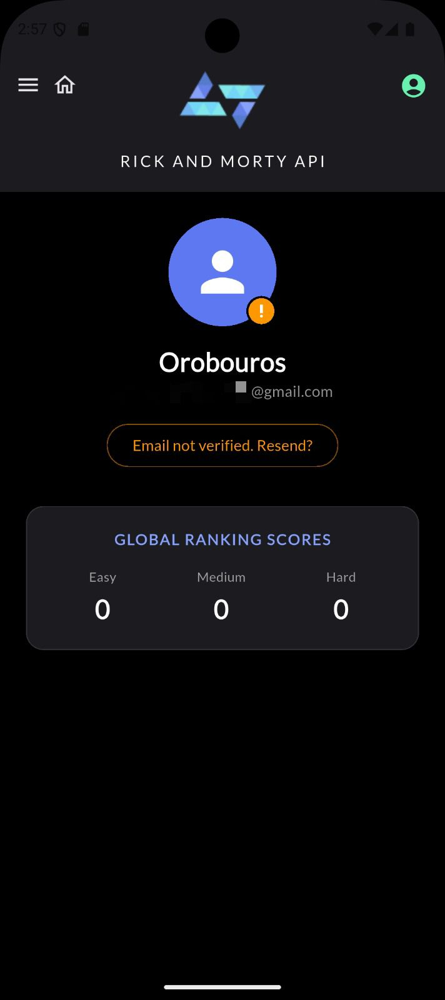
  </a>
  <a href="docs/screens/profile_page.png">
    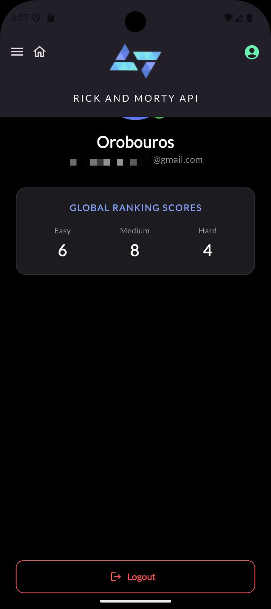
  </a>
</p>

### Wiki (Personagens, Locais, Episódios)

O núcleo clássico do Rickedex, com exibição de todos os dados que a API proporciona.

- **Personagens:** Listagem com paginação, cards, busca e filtros (espécie, status, gênero).

- **Detalhes de personagem:** Exibição de dados específicos: status de vida, espécie, gênero, última localização, primeira aparição, origem e número de episódios.

<p>
  <a href="docs/screens/characters_page.png">
    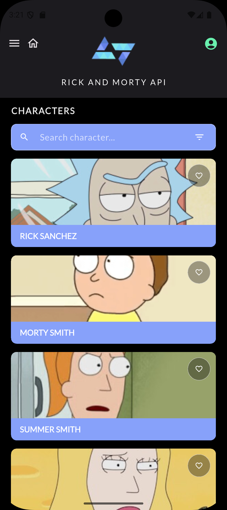
  </a>
  <a href="docs/screens/character_detailed.png">
    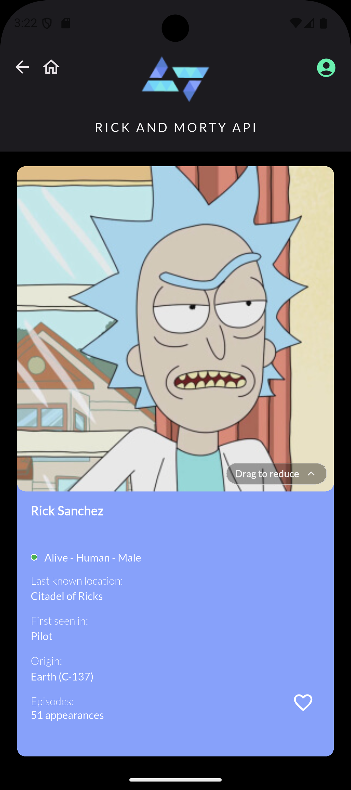
  </a>
  <a href="docs/screens/character_search.png">
    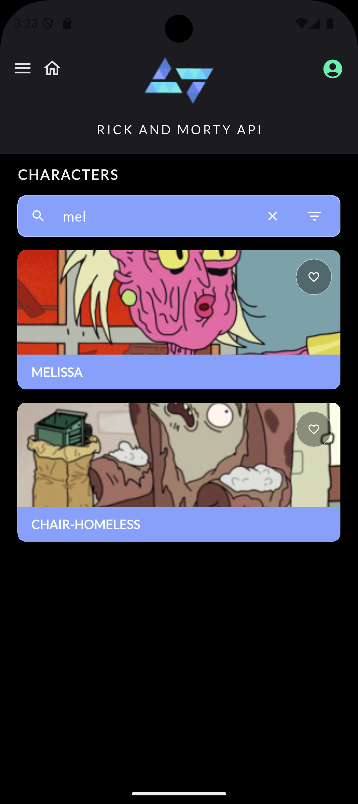
  </a>
  <a href="docs/screens/character_filter.png">
    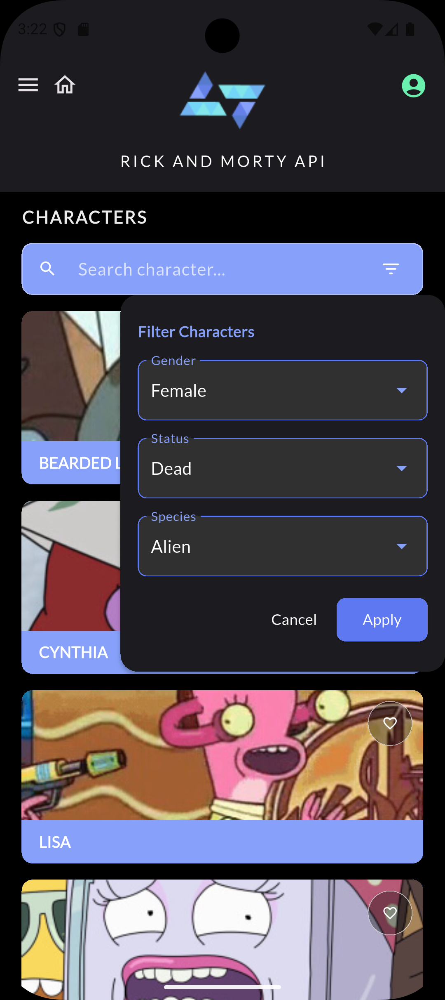
  </a>
</p>

- **Localidades:** Listagem com paginação, cards e filtro por dimensão integrado à navegação da página principal.

- **Detalhes de localidades:** Exibição de dados específicos: tipo, dimensão, número de residentes e lista de residentes.

<p>
  <a href="docs/screens/locations_page.png">
    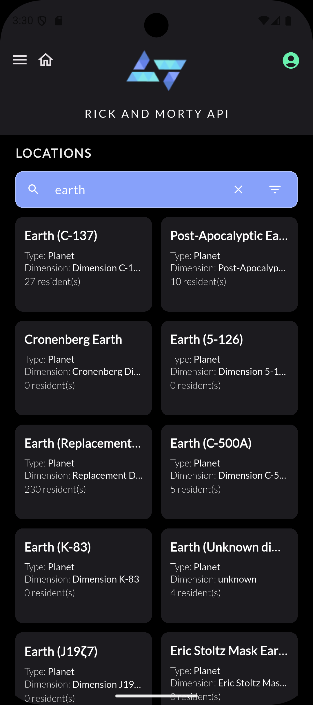
  </a>
  <a href="docs/screens/location_detailed.png">
    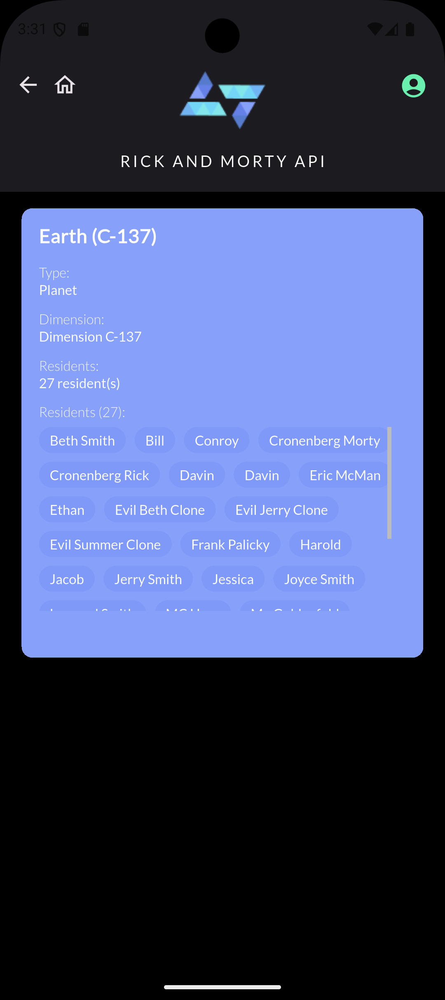
  </a>
  <a href="docs/screens/location_search.png">
    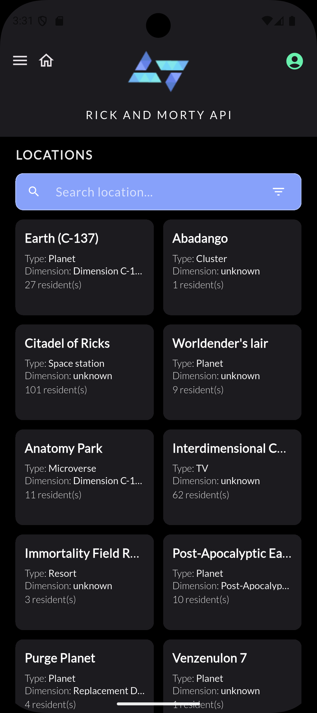
  </a>
  <a href="docs/screens/location_filter.png">
    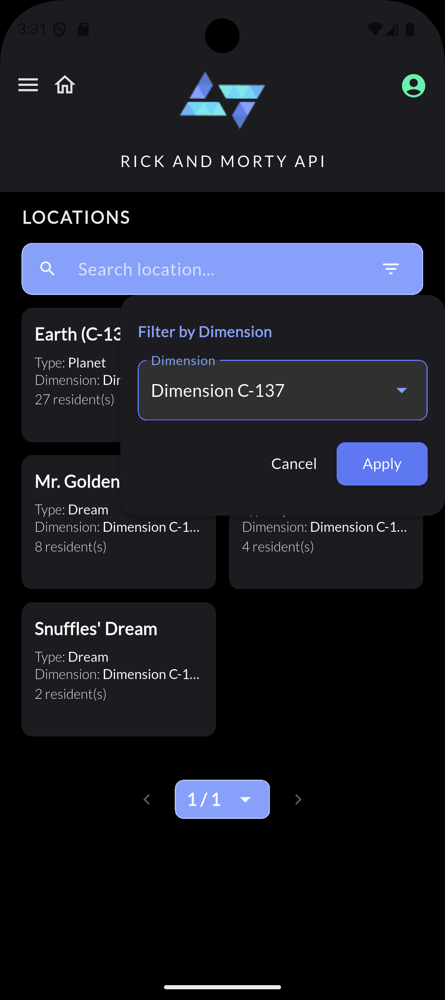
  </a>
</p>

- **Episódios:** Listagem de episódios, cards e filtro por temporada integrado à página principal.

- **Detalhes de episódios:** Exibição de dados específicos: data de lançamento e personagens presentes.

<p>
  <a href="docs/screens/episodes_page.png">
    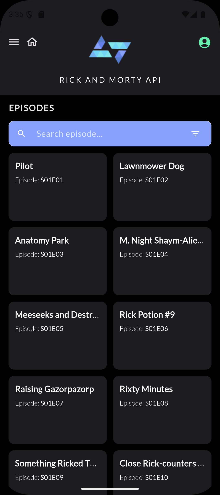
  </a>
  <a href="docs/screens/episode_detailed.png">
    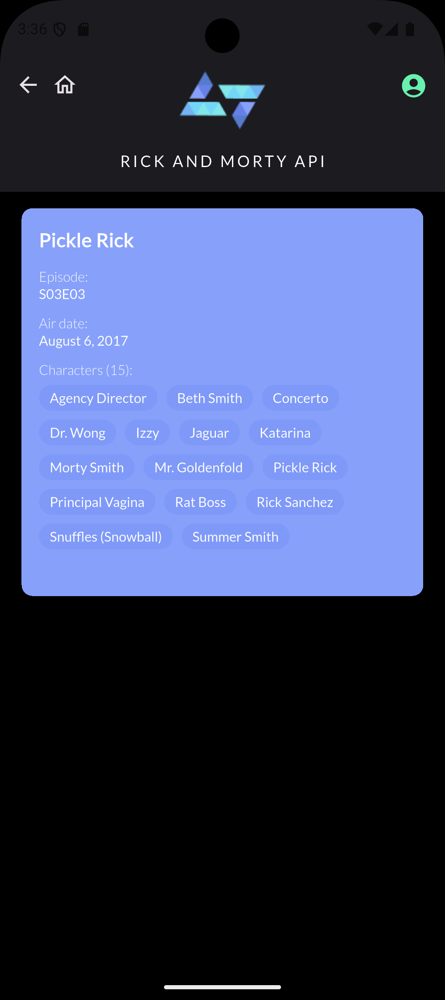
  </a>
  <a href="docs/screens/episode_search.png">
    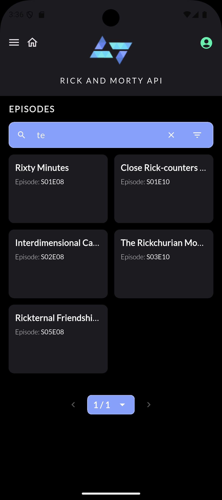
  </a>
  <a href="docs/screens/episode_filter.png">
    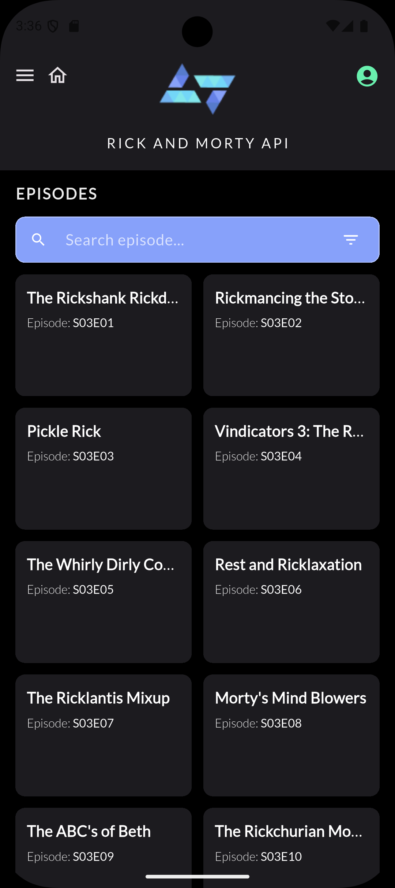
  </a>
</p>

## Utilidades

Páginas extra com novas funções que enriquecem a experiência de explorar o universo do Rick and Morty.

- **Favoritos:** Salva os personagens preferidos localmente, com exibição na barra lateral de navegação.

<p>
<a href="docs/screens/favorites_page.png">
    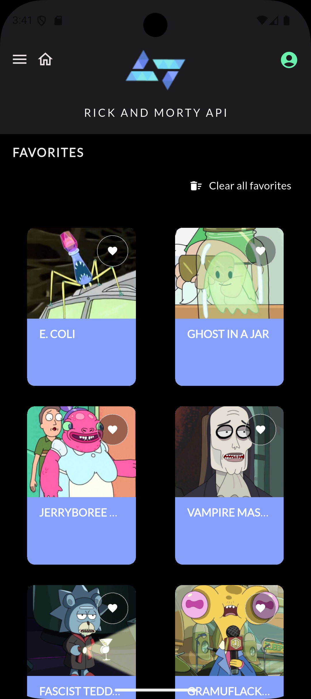
  </a>
</p>

- **Random:** Página que randomiza um personagem dentre todos presentes na API, com card clicável para levar à página de detalhes.

<p>
    <a href="docs/screens/random_page.png">
    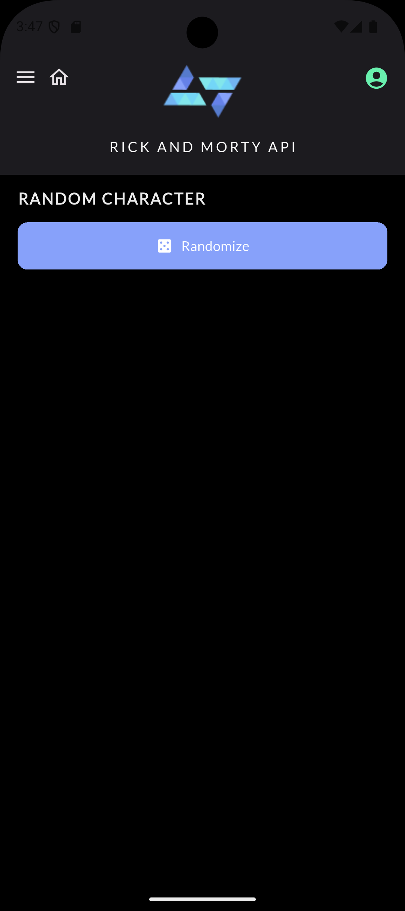
  </a>
  <a href="docs/screens/random_char.png">
    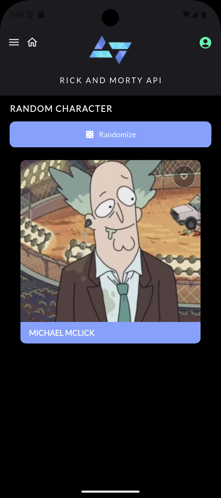
  </a>
</p>


### APK
- **Ícone personalizado** no APK
<p>
<a href="docs/screens/apk_icon.jpeg">
    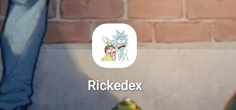
  </a>
</p>


> Todas as funcionalidades acima estão implementadas e integradas à UI.

---

## Navegação geral

- **Navegação Cruzada**: clicar em um local, episódio ou personagem dentro de um card leva ao card de detalhes específico referente ao selecionado.
- **Home**: listagem com imagens de páginas e funções do aplicativo.
- **Quiz**: quiz com 3 níveis de dificuldade + record.
- **Leaderboard**: exibição dos maiores 20 recordes de cada dificuldade do quiz.
- **Characters**: listagem de personagens + barra de busca + filtro.
- **Detalhes do Personagem**: card expandido com metadados completos e imagem expansível.
- **Locations**: listagem de localidades + barra de busca + filtro.
- **Detalhes de Localidades**: card expandido com metadados completos
- **Episodes**: listagem de episódios + barra de busca + filtro.
- **Detalhes do Episódios**: card expandido com metadados completos
- **Favoritos**: listagem de personagens favoritos previamente marcados.
- **Random**: botão para gerar personagem aleatório.
- **Profile sem conta**: opção de login ou registro.
- **Profile com conta**: exibição do e-mail, nick e recordes + opção de logout.


---
## Arquitetura & Padrões

O projeto segue uma arquitetura limpa e modular:

- **Service Pattern:** Lógica de negócios e comunicação com Firebase isolada em serviços (AuthService, QuizService, LeaderboardService).

- **Repository Pattern:** Abstração da camada de dados HTTP (Repository) usando Dio.

- **State Management:** Uso de ValueNotifier e ChangeNotifier para reatividade sem boilerplates em excesso.

- **Controller Pattern:** Separação de lógica de UI (ex: QuizGameController) da visualização (QuizPage).

- **Componentização:** UI quebrada em pequenos widgets reutilizáveis (AppConfirmationDialog, FeedImageStack, etc.).

### Estrutura de Pastas

```text
.
├── android/                                           # projeto Android nativo
├── ios/                                               # projeto iOS nativo
├── assets/                                            # recursos estáticos do app: imagens
├── lib/                                               # código-fonte principal (Flutter/Dart)
│   ├── components/                                    # componentes reutilizáveis de UI
│   ├── data/                                          # camada de acesso a dados
│   ├── models/                                        # modelos de domínio e respostas da API (character, episode, etc)
│   ├── pages/                                         # telas do app 
│   ├── services/                                      # serviços auxiliares (ex: favoritos, quiz)
│   ├── theme/                                         # tema centralizado (cores, tipografia, imagens)
│   ├── utils/                                         # utilitários/helpers (ex: id_from_url, quiz_generator)
│   └── main.dart                                      # ponto de entrada, MaterialApp, rotas e tema
├── test/                                              # testes (não utilizado no momento)
├── .dart_tool/                                        # artefatos internos do Dart/Flutter (gerado)
├── build/                                             # saídas de build (gerado)
├── docs/                                              # documentos utilizados fora da lib
├── .flutter-plugins                                   # plugins do Flutter (gerado)
├── .flutter-plugins-dependencies                      # dependências dos plugins (gerado)
├── .idea/                                             # metadados de IDE (Android Studio)
├── .metadata                                          # metadados do projeto Flutter (gerado)
├── analysis_options.yaml                              # regras de lint/análise estática
├── pubspec.yaml                                       # dependências, assets e config do app
├── pubspec.lock                                       # lockfile de versões (gerado)
├── README.md                                          # documentação do projeto
└── rick_morty_app.iml                                 # arquivo de projeto da IDE
```
---

## Compatibilidade
- Android (testado em emulador e dispositivo físico)
- iOS (build não configurado/testado)

---

## Instalação

Pré‑requisitos:
- Flutter instalado (canal **stable**)
- Para compilar o projeto é preciso configurar um projeto no Firebase e adicionar o arquivo google-services.json (Android) ou GoogleService-Info.plist (iOS) na pasta nativa, pois eles não são versionados no Git.

```
# 1. Instale as dependências
flutter pub get

# 2. Rode o projeto
flutter run
```

---

## Build de APK (Android)

Para gerar o instalável:
```
flutter build apk --release
```

Se aparecer um aviso de **NDK** (ex: algum plugin exige versão maior), ajuste a versão no arquivo `android/app/build.gradle.kts`:

O APK final ficará em:
```
build/app/outputs/flutter-apk/app-release.apk
```

### Ícone do APK (personalizado)
O app já inclui um ícone customizado. Para trocar:
1. Substitua o arquivo **icon.png** (ícone) em **assets/images** e rode ```dart run flutter_launcher_icons:main```

---

## API

- Base: `https://rickandmortyapi.com/api`

- Dados por **The Rick and Morty API**
  - [https://rickandmortyapi.com/](https://rickandmortyapi.com/)