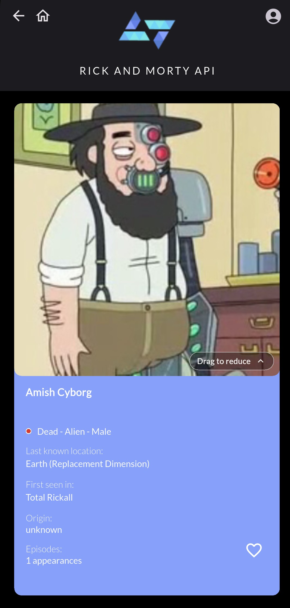
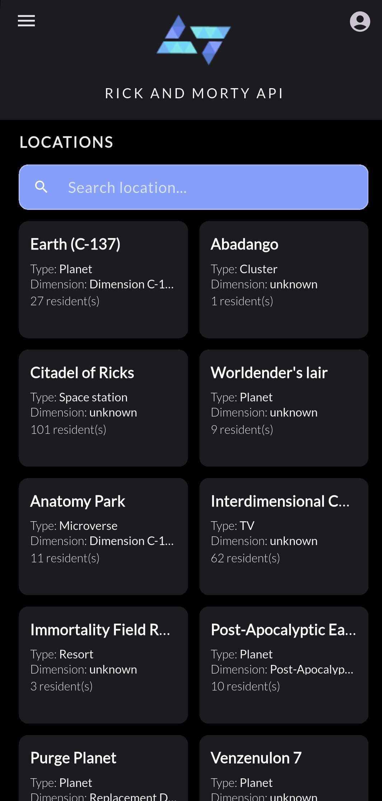
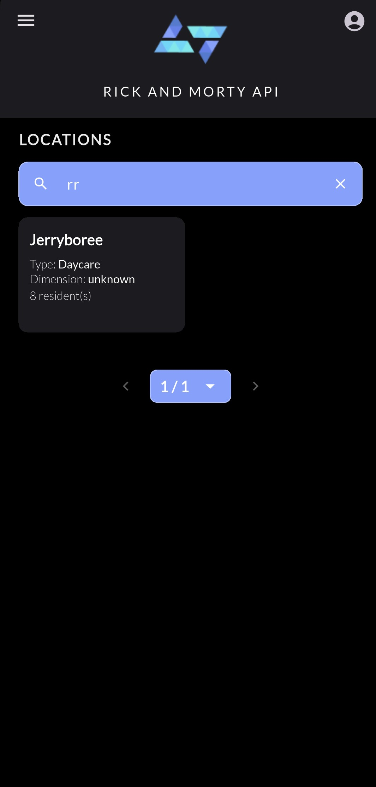
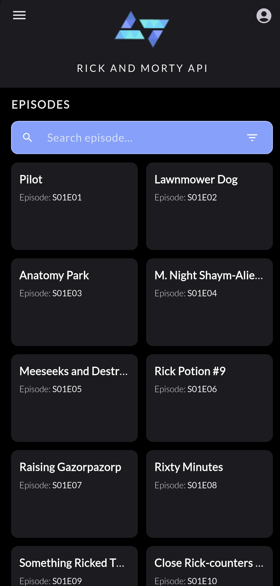
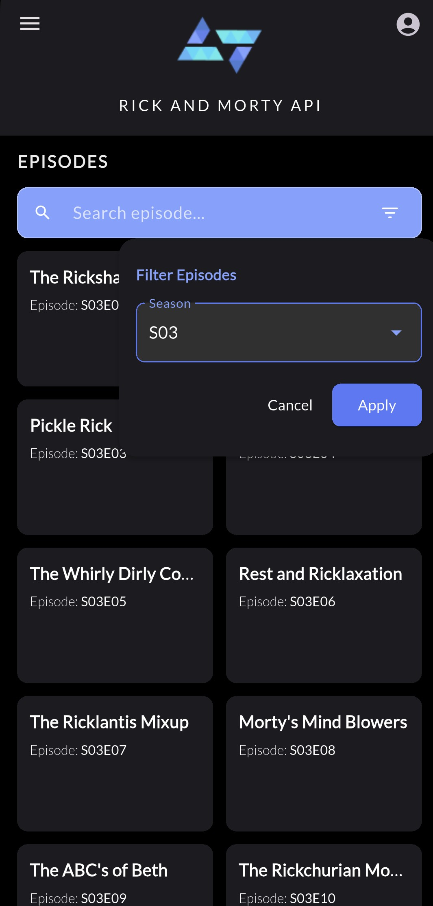

# Rickedex (Rick and Morty Pokédex)

Um app Flutter que funciona como uma Pokédex do universo de Rick and Morty: é possível pesquisar, filtrar e descobrir personagens, episódios e localidades consumindo a The Rick and Morty API.

> **Stack**: Flutter + Dart


---

## Índice
- [Funcionalidades](#funcionalidades)
  - [Personagens](#personagens)
  - [Localidades](#localidades)
  - [Episódios](#episódios)
  - [APK](#apk)
- [Navegação principal](#navegação-principal)
- [Componentes & Arquitetura](#componentes--arquitetura)
  - [Estrutura do Projeto](#estrutura-do-projeto)
  - [Padrões adotados](#padrões-adotados)
- [Busca & Filtros](#busca--filtros)
- [Como rodar](#como-rodar)
- [Build de APK (Android)](#build-de-apk-android)
  - [Ícone do APK (personalizado)](#ícone-do-apk-personalizado)
- [API](#api)

---

## Funcionalidades Principais

### Personagens
- **Listagem** (scroll + paginação)
- **Cards**: nome, imagem
- **Detalhes**: 
  - nome, imagem, espécie, gênero, status, origem, última localização, primeira aparição (episódio)
  - imagem com gesto de puxar para expandir
- **Busca** por nome (parcial ou completo)
- **Filtros**: gênero, status, espécie
- **Navegação**: de listagem → para detalhes
<p>
  <a href="docs/screens/characters_list.jpeg">
    
  </a>
  <a href="docs/screens/character_detailed.jpeg">
    
  </a>
  <a href="docs/screens/character_search.jpeg">
    
  </a>
  <a href="docs/screens/character_filter.jpeg">
    
  </a>
</p>

### Localidades
- **Listagem** (scroll + paginação)
- **Cards**: tipo, dimensão, número de residentes
- **Detalhes**: alguns moradores da localidade
- **Navegação**: de listagem → para detalhes
<p>
  <a href="docs/screens/locations_list.jpeg">
    
  </a>
  <a href="docs/screens/location_detailed.jpeg">
    
  </a>
  <a href="docs/screens/location_search.jpeg">
    
  </a>
</p>

### Episódios
- **Listagem** (scroll + paginação)
- **Cards**: nome, código
- **Detalhes**: data de exibição
- **Filtro**: temporada
- **Navegação**: de listagem → para detalhes
<p>
  <a href="docs/screens/episodes_list.jpeg">
    
  </a>
  <a href="docs/screens/episode_filter.jpeg">
    
  </a>
  <a href="docs/screens/episode_detailed.jpeg">
    
  </a>
</p>

### APK
- **Ícone personalizado** no APK
<p>
<a href="docs/screens/apk_icon.jpeg">
    
  </a>
</p>

### Favoritos
- **Página**: presente na sidebar
- **Cards**: nome, imagem
- **Ícone**: coração clicável sobre imagem dos cards
<p>
    <a href="docs/screens/sidebar_favorites.jpeg">
    
  </a>
  <a href="docs/screens/favorites_page.jpeg">
    
  </a>
</p>

> Todas as funcionalidades acima estão implementadas e integradas à UI.

---

## Navegação principal

- **Home/Characters**: listagem de personagens + barra de busca + filtro (ícone de funil ao lado da busca)
- **Detalhes do Personagem**: card expandido com metadados completos e imagem expansível
- **Locations**: listagem de localidades + barra de busca
- **Detalhes de Localidades**: card expandido com metadados completos
- **Episodes**: listagem de episódios + barra de busca + filtro (ícone de funil ao lado da busca)
- **Detalhes do Episódios**: card expandido com metadados completos
- **Favoritos**: listagem de personagens favoritos previamente marcados
- **Navegação Cruzada**: clicar em um local, episódio ou personagem dentro de um card leva ao card de detalhes específico referente ao selecionado.

---
## Componentes & Arquitetura

### Estrutura do Projeto

```text
.
├── android/                                           # projeto Android nativo
├── ios/                                               # projeto iOS nativo
├── assets/                                            # recursos estáticos do app
│   └── images/                                        # imagens do app
├── lib/                                               # código-fonte principal (Flutter/Dart)
│   ├── components/                                    # componentes reutilizáveis de UI
│   │   ├── app_bar/                                   # barra de navegação superior
│   │   ├── buttons/                                   # botões customizados
│   │   ├── cards/                                     # cards simples (ex: personagem, episódio, localidade)
│   │   ├── detailed_cards/                            # cards detalhados com informações completas
│   │   ├── filters/                                   # componentes de filtro (ex: gênero, status, temporada)
│   │   ├── grids/                                     # grades de exibição (ex: favoritos)
│   │   ├── navigation/                                # elementos de navegação (ex: sidebar, paginação, searchbar)
│   │   └── organization/                              # componentes organizacionais (ex: label de seção)
│   ├── data/                                          # camada de acesso a dados (repositories, chamadas HTTP)
│   ├── models/                                        # modelos de domínio e respostas da API (Character, Episode, etc)
│   ├── pages/                                         # telas do app (home, detalhes, favoritos, etc)
│   ├── services/                                      # serviços auxiliares (ex: favoritos)
│   ├── theme/                                         # tema centralizado (cores, tipografia, imagens)
│   ├── utils/                                         # utilitários/helpers (ex: id_from_url)
│   └── main.dart                                      # ponto de entrada, MaterialApp, rotas e tema
├── test/                                              # testes (não utilizado no momento)
├── .dart_tool/                                        # artefatos internos do Dart/Flutter (gerado)
├── build/                                             # saídas de build (gerado)
├── docs/                                              # documentos utilizados fora da lib
├── .flutter-plugins                                   # plugins do Flutter (gerado)
├── .flutter-plugins-dependencies                      # dependências dos plugins (gerado)
├── .idea/                                             # metadados de IDE (Android Studio)
├── .metadata                                          # metadados do projeto Flutter (gerado)
├── analysis_options.yaml                              # regras de lint/análise estática
├── pubspec.yaml                                       # dependências, assets e config do app
├── pubspec.lock                                       # lockfile de versões (gerado)
├── README.md                                          # documentação do projeto
└── rick_morty_app.iml                                 # arquivo de projeto da IDE
```

### Padrões adotados
- **Repository Pattern** para isolar chamadas **HTTP** (via **Dio**) aos endpoints `/character`, `/location`, `/episode`
- **Paginação** baseada em parâmetros da API
- **Componentização** de UI (cards, filtros, barras, etc.)
- **Tema centralizado** (cores, tipografia, imagens)

---

## Busca & Filtros

- **Busca por nome**: aceita trechos/parciais (ex: `ric`, `mort`)
- **Filtros de personagem**:
  - **Gênero**: Male, Female, Genderless, Unknown
  - **Status**: Alive, Dead, Unknown
  - **Espécie**: Human, Alien, Humanoid, Robot, Mythological Creature, Cronenberg, Poopybutthole, Disease, Unknown, Outros
- **Filtro por temporada (Episódios)**: por número da temporada

---

## Compatibilidade
- Android (testado em emulador e dispositivo físico)
- iOS (build não configurado/testado)

---

## Como rodar

Pré‑requisitos:
- Flutter instalado (canal **stable**)
- Android SDK / Emulador ou dispositivo físico (modo desenvolvedor)

Instalação e execução:

```
flutter pub get
flutter run
```

---

## Build de APK (Android)

Gerar APK **release**:
```
flutter build apk --release
```

Se aparecer um aviso de **NDK** (ex: algum plugin exige versão maior), ajuste a versão no arquivo `android/app/build.gradle.kts`:

```kts
android {
    ndkVersion = "27.0.12077973"
}
```

O APK final ficará em:
```
build/app/outputs/flutter-apk/app-release.apk
```

### Ícone do APK (personalizado)
O app já inclui um ícone customizado. Para trocar rapidamente:
1. Substitua o arquivo **icon.png** (ícone) em **assets/images** e rode ```dart run flutter_launcher_icons:main```
2. Ajuste o **nome do app** (opcional) em `android/app/src/main/AndroidManifest.xml` (`android:label`)

---

## API

- Base: `https://rickandmortyapi.com/api`
- Recursos utilizados: /character, /location, /episode
- Parâmetros comuns: page, id, name, status, gender, species 

---

- Dados por **The Rick and Morty API**
  - [https://rickandmortyapi.com/](https://rickandmortyapi.com/)
